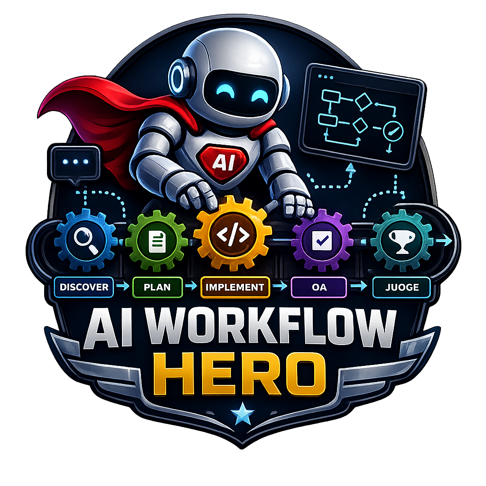

<p align="center">
  <a href="#english">🇺🇸 English</a> |
  <a href="#portugues-br">🇧🇷 Português</a>
</p>

<h1 align="center">AI Workflow Hero</h1>

<p align="center">
  Framework open-source for AI-augmented software development.
  <br>
  Coordinates specialized subagents, compresses context, and makes development cycles reproducible — without locking you to a single LLM.
</p>

<p align="center">
  
  
  
  
  
</p>

<p align="center">
  
</p>

---

<a id="english"></a>

# 🇺🇸 English

**AI Workflow Hero (Hero)** is an open-source framework for AI-augmented software development. It does **not** replace your coding agent — it coordinates specialized subagents, organizes project artifacts, compresses context, and makes AI-driven development cycles reproducible and less dependent on any single LLM provider.

Hero ships as a single Go CLI binary (`hero`) that bootstraps a project with commands, skills, prompts, and templates for **Cursor** (V1). After install you can drive the same cycle from **Cursor chat** (`/hero-<name>` slash commands) or the **Hero TUI** (`hero` in a terminal). LLM reasoning stays in the harness agents — never inside the CLI binary.

Designed for an open-source workflow, it helps you move through:

**Research → Planning → Implementation → QA → Judge → Browser UI Validation → QA End-to-End**

---

## Features

- Deterministic CLI for install, upgrade, uninstall, doctor, status, metrics, events, cycle lifecycle, variables, and model pricing updates
- **Hero TUI** (default `hero` command): Bubble Tea UI for cycle status, approvals, artifacts, costs, and events — SQLite store is created automatically on install and on first CLI/TUI use
- TUI command palette uses `/hero-<name>` labels; can also list non-Hero Cursor commands from `.cursor/commands` (and `~/.cursor/commands`) and run them by expanding the markdown into the harness agent
- `hero doctor` / install warn when other harness folders are detected but unsupported (Cursor-only assets in V1)
- `/hero-archive` archives the linked OpenSpec change first (`openspec archive -y`), then the Hero cycle folder (force path if OpenSpec fails)
- Cursor Runtime assets: 15 `/hero-<name>` commands and 11 specialized agents
- Configurable stage flow with human approval, iteration limits, timeouts, and escalation
- Scope routing to `backend_agent`, `frontend_agent`, or `generic_agent`
- Three-level model fallback (`agent model` → `fallback_model` → wait for `/hero-continue`)
- Context compression files (`AGENTS.md`, `context/current-state.md`, `context/context-log.md`)
- OpenSpec integration for SDD planning and task-driven implementation
- Research produces project specifications (PRD, ADR, UI, DEPLOY, TESTING) with cycle numbering; architecture changes require an approved ADR
- Implementation logging standard (`error` / `info` / `debug`, default `info`) enforced by `qa_agent`
- Soft secrets hygiene: `.env.example` + `.gitignore` patterns; `hero doctor` warns, never blocks
- Optional Browser UI Validation (`stages.browser_ui_validation`, requires `scope.frontend`): Playwright Health + optional Visual vs PNGs under `docs/ui/visual_reference`
- Opt-in Playwright for QA End-to-End journeys (`stages.qa_end_to_end.use_playwright`, requires `scope.frontend`) — distinct from Browser UI Validation
- Parallel Task fan-out for independent implementation work; clean subagent sessions via file pointers
- Per-cycle metrics and project-wide cost estimates from structured model pricing files
- Upgrade safety: customized Hero files are never silently overwritten (checksum comparison)
- Uninstall removes only Hero-owned paths; project knowledge (`AGENTS.md`, `docs/`, `context/`, `openspec/`) is preserved
- Installed user guide at `.workflow-hero/docs/workflow-help.md` (path printed after `hero install`)

---

## Installation

Ready-to-use binaries will be published in the repository [Releases](https://github.com/ricrsantos/ai_workflow_hero/releases) section.

### From a release binary (recommended)

1. Download the artifact matching your OS/architecture, for example:
   - `hero_v1.0.0_linux_amd64`
   - `hero_v1.0.0_linux_arm64`
   - `hero_v1.0.0_darwin_amd64`
   - `hero_v1.0.0_darwin_arm64`
2. (Optional) Verify the SHA256 checksum against `checksums.txt`.
3. Make it executable and place it on your `PATH`:

```bash
chmod +x hero_v1.0.0_linux_amd64
sudo mv hero_v1.0.0_linux_amd64 /usr/local/bin/hero
hero version
```

### From source

```bash
git clone https://github.com/ricrsantos/ai_workflow_hero.git
cd ai_workflow_hero
go build -ldflags "-X main.version=$(git describe --tags --abbrev=0 2>/dev/null || echo dev)" -o hero ./cmd/hero
sudo mv hero /usr/local/bin/hero
```

---

## Quick Start

Inside the target project (must be a git repository, or pass `--git-init`):

```bash
# Interactive (select Cursor and/or OpenCode harnesses)
hero install

# Scripted project fields only (harness choice stays interactive in 2.0)
hero install --name "My Project" --summary "Short project summary" --yes --git-init
```

After install, manage harnesses in the TUI with `/hero-harness` and pick the default freechat model pair with `/hero-model` (`model · harness`). OpenCode runs via Hero-managed `opencode serve` (started lazily on first TUI Execute).

Then, in Cursor chat:

1. `/hero-sync` — activate Hero in an existing codebase (optional but recommended)
2. `/hero-new` — start a new development cycle
3. Edit `.workflow-hero/cycles/current/workflow-config.yml` (`title` / `objective` / `scope` / optional `workflow_config.user_preferred_language`; prior cycles also re-import language/models/stages from the last cycle)
4. Open a **new empty chat**, select the agent you want as the Hero **orchestrator / grill-me**, then `/hero-start`

After install, read the full user guide at `.workflow-hero/docs/workflow-help.md` (philosophy, configuration, CLI and Runtime commands).

Useful CLI commands after install:

```bash
hero                 # open the Hero TUI (default)
hero tui             # same as default
hero doctor
hero status
hero status --json
hero metrics
hero events
hero variables
hero upgrade
hero update-models
hero uninstall
```

Cycle control from the CLI (same API the TUI and chat agents use) includes `hero approve`, `hero reject`, `hero finish`, `hero cycle archive`, and related verbs — see `.workflow-hero/docs/workflow-help.md`.

---

## Hero TUI

The **Hero Terminal UI** is the interactive front door for the CLI after the project is bootstrapped. It shares the same Go state machine and SQLite store (`.workflow-hero/hero.db`) as `hero status`, `hero approve`, and the other deterministic commands.

### Prerequisites

1. Hero binary on your `PATH` (release or built from source). Use a **1.0+** binary (`hero version`) — older 0.9 installs on `PATH` will not open this TUI.
2. Project already initialized: `hero install` (creates `.workflow-hero/` **and** `hero.db`; select at least one harness).
3. A real interactive terminal (TTY). The integrated Cursor terminal works; piping or `NO_COLOR=1` will refuse to launch the TUI.

The operational database is **never** a manual step: `hero install` creates it, and any later `hero` / `hero status` / `hero doctor` run will create or migrate it automatically (including a one-shot import of legacy `workflow.md` when upgrading from 0.9.x layouts).

### Launch

```bash
cd /path/to/your/project
hero          # preferred — default command
# or explicitly:
hero tui
```

If Hero is **not** installed in the current project:

```text
✗ Error: Hero is not installed in this project — run: hero install.
→ Suggestion: Install Hero in this project first, then run `hero` again to open the TUI.
```

If the session is not a TTY (or `NO_COLOR` is set), use plain CLI instead:

```bash
hero status
hero metrics --json
hero events
```

### No active cycle

If Status shows *No active cycle*, start one from the TUI or Cursor chat:

1. `/hero-new` — in the TUI (Commands menu or Chat), expands `hero-new.md` with your default harness model and walks through `workflow-config.yml` preparation (same flow as Cursor chat)
2. Edit `.workflow-hero/cycles/current/workflow-config.yml` (`title` / `objective` / `scope`) when the agent asks you to review
3. Run `/hero-start` (TUI or chat) to execute configured stages; in chat, prefer a **new empty chat** with your orchestrator / grill-me agent

Refresh the TUI (`Ctrl+R`) after the cycle is created to see it on the Status screen.

### Screens and shortcuts

| Key | Action |
|---|---|
| `1` | **Status** — cycle title, objective, stage table (`openspec_change` when set) |
| `2` | **Approvals** — pending stage; approve / reject / finish / cancel |
| `3` | **Artifacts** — artifact metadata from the store |
| `4` | **Costs** — token / cost metrics |
| `5` | **Events** — recent operational event log |
| `/` | **Commands** menu — press `/`, type to filter, Enter to run (Claude Code–style; use this instead of `Ctrl+P`, which opens Cursor’s palette in the IDE terminal) |
| `Ctrl+R` / `F5` | Refresh from SQLite |
| `a` | Approve (on Approvals screen) |
| `r` | Reject (on Approvals screen) |
| `f` | Finish cycle (on Approvals screen) |
| `c` | Cancel cycle (on Approvals screen) |
| `d` | Dispatch harness (`hero run` / Cursor adapter, best-effort) |
| `6` / `Ctrl+6` / `Alt+6` | **Chat** — harness conversation (free chat or active stage) |
| `q` / `Ctrl+C` | Quit |
| `Esc` | Close the Commands menu |

### Commands menu (`/`)

Press `/` to open the palette (filter with typing, Enter to run). Default items:

| Command | Function |
|---|---|
| `Go to - Status` | Open the Status screen |
| `Go to - Approvals` | Open the Approvals screen |
| `Go to - Artifacts` | Open the Artifacts screen |
| `Go to - Costs` | Open the Costs screen |
| `Go to - Events` | Open the Events screen |
| `/hero-new` | Start a new cycle via `hero-new.md` on the Chat screen (streaming; default harness model) |
| `/hero-start` | Dispatch the active stage to the harness (`hero run`, best-effort) |
| `/hero-sync` | Expand `hero-sync.md` and dispatch to the harness (best-effort) |
| `/hero-status` | Show a cycle status summary |
| `/hero-approve` | Approve the pending stage |
| `/hero-reject` | Reject the pending stage (returns it to Waiting) |
| `/hero-continue` | Grant +1 extra iteration on the active stage |
| `/hero-back` | Expand `hero-back.md` and dispatch to the harness (best-effort) |
| `/hero-cancel` | Cancel the active cycle |
| `/hero-finish` | Finish the active cycle |
| `/hero-archive` | Archive the cycle (OpenSpec when linked, then move the cycle folder) |
| `/hero-resume` | Reactivate an archived cycle |
| `/hero-cycles` | List all cycles with per-stage metrics |
| `/hero-todos` | List pending items from `context/current-state.md` |
| `/hero-model` | Pick the default harness model (Chat + non-agent dispatches; persisted to `hero.json` → `harnesses.<tool>.model`) |
| `/hero-help` | Point to `.workflow-hero/docs/workflow-help.md` |
| `Refresh` | Reload Status, Costs, Events, and Artifacts from SQLite |
| `Quit` | Exit the TUI |

The palette can also list **imported** Cursor custom commands from the project’s `.cursor/commands/` and your user `~/.cursor/commands/` (excluding Hero’s own `hero-*.md`). Selecting an imported command expands that markdown file and dispatches it to the Cursor agent (best-effort) — the same idea as typing the slash in chat, without injecting into an already-open IDE panel.

Project skills under `.cursor/skills/` are **not** listed in the TUI; the Cursor agent loads them automatically when a dispatch runs with the project as cwd.

### Dual entry with Cursor chat

You can drive the same cycle from either:

- **TUI** — `hero` in the terminal (monitor, approve, finish, dispatch, imported commands)
- **Chat** — `/hero-<name>` slash commands in Cursor (grilling, planning, implementation reasoning; agents call the same CLI/SQLite API)

Pick one entry UI per session for control actions; both read and write `.workflow-hero/hero.db`. New cycles still start with `/hero-new` in chat.

### Tips

- In Cursor’s integrated terminal, open Hero commands with **`/`**, not `Ctrl+P` (that shortcut belongs to the IDE).
- Keep the TUI open while agents work in Cursor to watch status, events, and costs update after you refresh (`Ctrl+R`).
- Scripting and CI should use `hero status --json` / `hero metrics --json`, not the TUI.
- Uninstall removes `.workflow-hero/` (including the DB); project docs and `context/` stay.

---

## Runtime Commands (Cursor chat)

| Command | Purpose |
|---|---|
| `/hero-new` | Start a new development cycle (imports prior models/stages; reset title/objective/scope; then prefer a new chat for start) |
| `/hero-start` | Execute configured stages (prefer new empty chat; select orchestrator / grill-me first) |
| `/hero-approve` | Approve the current stage |
| `/hero-reject` | Reject and request changes |
| `/hero-cancel` | Cancel the stage and restore the git checkpoint |
| `/hero-continue` | Grant extra iterations after escalation |
| `/hero-back` | Reopen Planning after SDD ambiguity |
| `/hero-finish` | Finish the cycle; records `completed_at` in SQLite (used by archive naming) |
| `/hero-archive` | Archive OpenSpec change (when linked) then the Hero cycle folder (date = `completed_at`) |
| `/hero-resume` | Resume an archived cycle |
| `/hero-sync` | Activate / re-sync Hero on an existing project (merges pending items from product/architecture docs) |
| `/hero-status` | Show cycle status in chat |
| `/hero-cycles` | List all cycles with per-etapa metrics |
| `/hero-todos` | Show pending items from `context/current-state.md` |
| `/hero-model` | Select the TUI default harness model (required once per project before Chat or harness dispatches; terminal palette; persisted in `hero.json`) |
| `/hero-help` | List Runtime commands |

---

## Requirements

### End users

- Linux or macOS (`amd64` or `arm64`)
- [Cursor](https://cursor.com) IDE (V1)
- Git (required; `hero install` can run `git init` with consent)
- [OpenSpec](https://github.com/Fission-AI/OpenSpec) for Planning-stage workflows and for `/hero-archive` when a change is linked (installed with user consent when needed)

### Development

- Go 1.25+ (see `go.mod`)
- Git

```bash
git clone https://github.com/ricrsantos/ai_workflow_hero.git
cd ai_workflow_hero
go test ./...
go build -o hero ./cmd/hero
```

---

## Build and Test

```bash
go test ./...
go build -ldflags "-X main.version=$(git describe --tags --abbrev=0)" -o hero ./cmd/hero
```

Cross-compiled release artifacts (4 platforms + `checksums.txt`):

```bash
./scripts/release.sh
# → dist/hero_<version>_linux_amd64
# → dist/hero_<version>_linux_arm64
# → dist/hero_<version>_darwin_amd64
# → dist/hero_<version>_darwin_arm64
# → dist/checksums.txt
```

---

## Project Structure

```text
.
├── cmd/hero/                 # CLI entrypoint (Cobra); default → TUI
├── internal/
│   ├── install/              # hero install
│   ├── upgrade/              # hero upgrade
│   ├── uninstall/            # hero uninstall
│   ├── doctor/               # hero doctor
│   ├── status/               # hero status
│   ├── cycle/                # cycle lifecycle + CLI-as-API
│   ├── store/                # SQLite operational store
│   ├── engine/               # AI Loop state machine
│   ├── tui/                  # Bubble Tea Hero TUI
│   ├── harness/              # HarnessAdapter interface
│   ├── variables/            # hero variables
│   ├── update_models/        # hero update-models
│   ├── adapters/cursor/      # Cursor adapter + path layout
│   ├── common/               # errors, output, templates
│   └── integration/          # lightweight e2e tests
├── assets/                   # embed.FS (commands, agents, skills, templates, models)
├── scripts/release.sh        # manual cross-compile release
├── docs/                     # PRD, UI, ADR, DEPLOY
├── context/                  # this repo's compressed project memory
├── openspec/                 # SDD / change planning for Hero itself
├── AGENTS.md
├── go.mod
└── README.md
```

---

## Documentation

| Document | Path |
|---|---|
| Product Requirements | [docs/product/PRD.md](docs/product/PRD.md) |
| Terminal UX Spec | [docs/product/UI.md](docs/product/UI.md) |
| Architecture Decision Records | [docs/architecture/ADR.md](docs/architecture/ADR.md) |
| Deployment Guide | [docs/deployment/DEPLOY.md](docs/deployment/DEPLOY.md) |
| Agent guidance | [AGENTS.md](AGENTS.md) |
| End-user guide (installed into projects) | [assets/docs/workflow-help.md](assets/docs/workflow-help.md) → `.workflow-hero/docs/workflow-help.md` |

---

## Contributing

Contributions are welcome.

1. Open an issue for bugs, UX feedback, or feature requests.
2. Fork the repository and create a branch from `main`.
3. Keep changes focused; follow the Feature Based + Vertical Slice layout under `internal/<feature>/`.
4. Run:

```bash
go test ./...
```

5. Open a Pull Request with a clear description of **why** the change is needed.

Please do not introduce V1 out-of-scope items (Windows binaries, CI/CD release automation, non-Cursor adapters, or CLI commands that perform LLM reasoning). See [PRD §2.3](docs/product/PRD.md).

---

## License

BSD 2-Clause. See [LICENSE](LICENSE).

---

<a id="portugues-br"></a>

# 🇧🇷 Português (BR)

**AI Workflow Hero (Hero)** é um framework open-source para desenvolvimento de software aumentado por IA. Ele **não** substitui o agente de código — ele coordena subagentes especializados, organiza artefatos do projeto, comprime contexto e torna ciclos de desenvolvimento com IA mais reproduzíveis e menos dependentes de um único provedor de LLM.

O Hero é distribuído como um binário CLI em Go (`hero`) que prepara o projeto com comandos, skills, prompts e templates para o **Cursor** (V1). Depois de instalado, você conduz o mesmo ciclo pelo **chat do Cursor** (comandos `/hero-<name>`) ou pela **Hero TUI** (`hero` no terminal). O raciocínio com LLM fica nos agentes do harness — nunca dentro do binário CLI.

Projetado para um fluxo open source, ele ajuda você a avançar em:

**Research → Planning → Implementation → QA → Judge → Browser UI Validation → QA End-to-End**

---

## Recursos

- CLI determinística para install, upgrade, uninstall, doctor, status, metrics, events, ciclo, variables e atualização de preços de modelos
- **Hero TUI** (comando padrão `hero`): interface Bubble Tea para status do ciclo, aprovações, artefatos, custos e eventos — o store SQLite é criado automaticamente no install e no primeiro uso da CLI/TUI
- Palette da TUI com labels `/hero-<name>`; também lista commands Cursor de `.cursor/commands` (e `~/.cursor/commands`) e os executa expandindo o markdown para o agente do harness
- `hero doctor` / install avisam quando detectam pastas de outros harnesses ainda não suportados (V1 só materializa Cursor)
- `/hero-archive` arquiva primeiro o change OpenSpec ligado (`openspec archive -y`) e depois a pasta do ciclo Hero (com caminho de force se o OpenSpec falhar)
- Assets de Runtime no Cursor: 15 comandos `/hero-<name>` e 11 agentes especializados
- Fluxo de stages configurável com aprovação humana, limites de iteração, timeouts e escalonamento
- Roteamento de scope para `backend_agent`, `frontend_agent` ou `generic_agent`
- Fallback de modelo em 3 níveis (`modelo do agente` → `fallback_model` → espera `/hero-continue`)
- Arquivos de compressão de contexto (`AGENTS.md`, `context/current-state.md`, `context/context-log.md`)
- Integração com OpenSpec para planejamento SDD e implementação orientada a tarefas
- Research gera especificações do projeto (PRD, ADR, UI, DEPLOY, TESTING) com numeração por ciclo; mudanças de arquitetura exigem ADR aprovado
- Padrão de logging na implementação (`error` / `info` / `debug`, default `info`) verificado pelo `qa_agent`
- Higiene suave de secrets: `.env.example` + padrões no `.gitignore`; `hero doctor` avisa, não bloqueia
- Browser UI Validation opcional (`stages.browser_ui_validation`, exige `scope.frontend`): Health com Playwright + Visual opcional vs PNGs em `docs/ui/visual_reference`
- Playwright opcional no QA End-to-End para jornadas (`stages.qa_end_to_end.use_playwright`, exige `scope.frontend`) — distinto do Browser UI Validation
- Fan-out paralelo via Task para implementação independente; sessões limpas de subagentes com ponteiros de arquivo
- Métricas por ciclo e estimativas de custo do projeto a partir de arquivos estruturados de pricing
- Segurança no upgrade: arquivos customizados do Hero nunca são sobrescritos em silêncio (checksum)
- Uninstall remove apenas caminhos do Hero; o conhecimento do projeto (`AGENTS.md`, `docs/`, `context/`, `openspec/`) é preservado
- Guia do usuário instalado em `.workflow-hero/docs/workflow-help.md` (caminho exibido após `hero install`)

---

## Instalação

Os binários prontos para uso serão publicados na seção de [Releases](https://github.com/ricrsantos/ai_workflow_hero/releases) do repositório.

### A partir do binário de release (recomendado)

1. Baixe o artefato correspondente ao seu SO/arquitetura, por exemplo:
   - `hero_v1.0.0_linux_amd64`
   - `hero_v1.0.0_linux_arm64`
   - `hero_v1.0.0_darwin_amd64`
   - `hero_v1.0.0_darwin_arm64`
2. (Opcional) Verifique o checksum SHA256 em `checksums.txt`.
3. Torne-o executável e coloque-o no `PATH`:

```bash
chmod +x hero_v1.0.0_linux_amd64
sudo mv hero_v1.0.0_linux_amd64 /usr/local/bin/hero
hero version
```

### A partir do código-fonte

```bash
git clone https://github.com/ricrsantos/ai_workflow_hero.git
cd ai_workflow_hero
go build -ldflags "-X main.version=$(git describe --tags --abbrev=0 2>/dev/null || echo dev)" -o hero ./cmd/hero
sudo mv hero /usr/local/bin/hero
```

---

## Início rápido

Dentro do projeto-alvo (precisa ser um repositório git, ou use `--git-init`):

```bash
# Interativo (selecione Cursor e/ou OpenCode)
hero install

# Campos do projeto scriptados (escolha de harness continua interativa no 2.0)
hero install --name "Meu Projeto" --summary "Resumo curto do projeto" --yes --git-init
```

Depois do install, gerencie harnesses no TUI com `/hero-harness` e escolha o par padrão freechat com `/hero-model`. OpenCode usa `opencode serve` gerenciado pelo Hero.

Em seguida, no chat do Cursor:

1. `/hero-sync` — ativa o Hero em um codebase existente (opcional, mas recomendado)
2. `/hero-new` — inicia um novo ciclo de desenvolvimento
3. Edite `.workflow-hero/cycles/current/workflow-config.yml` (`title` / `objective` / `scope` / opcional `workflow_config.user_preferred_language`; ciclos anteriores também reimportam idioma/modelos/stages do último ciclo)
4. Abra um **chat novo e vazio**, selecione o agente que deseja como **orchestrator / grill-me** do Hero, e então `/hero-start`

Após a instalação, leia o guia completo em `.workflow-hero/docs/workflow-help.md` (filosofia, configuração, comandos CLI e Runtime).

Comandos CLI úteis após a instalação:

```bash
hero                 # abre a Hero TUI (padrão)
hero tui             # igual ao padrão
hero doctor
hero status
hero status --json
hero metrics
hero events
hero variables
hero upgrade
hero update-models
hero uninstall
```

O controle de ciclo pela CLI (a mesma API que a TUI e os agentes do chat usam) inclui `hero approve`, `hero reject`, `hero finish`, `hero cycle archive` e afins — veja `.workflow-hero/docs/workflow-help.md`.

---

## Hero TUI

A **Hero Terminal UI** é a porta de entrada interativa da CLI depois que o projeto foi preparado. Ela usa a mesma máquina de estados Go e o mesmo store SQLite (`.workflow-hero/hero.db`) que `hero status`, `hero approve` e os demais comandos determinísticos.

### Pré-requisitos

1. Binário `hero` no `PATH` (release ou build local). Use um binário **1.0+** (`hero version`) — instalações 0.9 no `PATH` não abrem esta TUI.
2. Projeto já inicializado: `hero install` (cria `.workflow-hero/` **e** `hero.db`; selecione ao menos um harness).
3. Terminal interativo de verdade (TTY). O terminal integrado do Cursor serve; pipe ou `NO_COLOR=1` impedem a TUI.

O banco operacional **não** é um passo manual: `hero install` cria o arquivo, e qualquer `hero` / `hero status` / `hero doctor` posterior cria ou migra automaticamente (incluindo import único de `workflow.md` legado ao subir de layouts 0.9.x).

### Como abrir

```bash
cd /caminho/do/seu/projeto
hero          # preferido — comando padrão
# ou explicitamente:
hero tui
```

Se o Hero **não** estiver instalado no projeto atual:

```text
✗ Error: Hero is not installed in this project — run: hero install.
→ Suggestion: Install Hero in this project first, then run `hero` again to open the TUI.
```

Se a sessão não for TTY (ou `NO_COLOR` estiver definido), use a CLI em texto:

```bash
hero status
hero metrics --json
hero events
```

### Sem ciclo ativo

Se o Status mostrar *No active cycle*, inicie um ciclo pela TUI ou pelo chat do Cursor:

1. `/hero-new` — na TUI (menu Commands ou Chat), expande `hero-new.md` com o modelo default do harness e conduz a preparação do `workflow-config.yml` (mesmo fluxo do chat do Cursor)
2. Edite `.workflow-hero/cycles/current/workflow-config.yml` (`title` / `objective` / `scope`) quando o agente pedir revisão
3. Execute `/hero-start` (TUI ou chat) para rodar as etapas; no chat, prefira um **chat novo e vazio** com o orchestrator / grill-me

Atualize a TUI (`Ctrl+R`) depois que o ciclo for criado para vê-lo na tela Status.

### Telas e atalhos

| Tecla | Ação |
|---|---|
| `1` | **Status** — título, objetivo, tabela de stages (`openspec_change` quando definido) |
| `2` | **Approvals** — stage pendente; approve / reject / finish / cancel |
| `3` | **Artifacts** — metadados de artefatos no store |
| `4` | **Costs** — métricas de tokens / custo |
| `5` | **Events** — log recente de eventos operacionais |
| `/` | Menu de **Commands** — pressione `/`, digite para filtrar, Enter para executar (estilo Claude Code; use isto em vez de `Ctrl+P`, que abre a palette do Cursor no terminal da IDE) |
| `Ctrl+R` / `F5` | Atualizar a partir do SQLite |
| `a` | Approve (na tela Approvals) |
| `r` | Reject (na tela Approvals) |
| `f` | Finish do ciclo (na tela Approvals) |
| `c` | Cancel do ciclo (na tela Approvals) |
| `d` | Dispatch do harness (`hero run` / adapter Cursor, best-effort) |
| `6` / `Ctrl+6` / `Alt+6` | **Chat** — conversa com o harness (free chat ou etapa ativa) |
| `q` / `Ctrl+C` | Sair |
| `Esc` | Fechar o menu de Commands |

### Menu de Commands (`/`)

Pressione `/` para abrir a palette (digite para filtrar, Enter para executar). Itens padrão:

| Comando | Função |
|---|---|
| `Go to - Status` | Abre a tela Status |
| `Go to - Approvals` | Abre a tela Approvals |
| `Go to - Artifacts` | Abre a tela Artifacts |
| `Go to - Costs` | Abre a tela Costs |
| `Go to - Events` | Abre a tela Events |
| `/hero-new` | Inicia um novo ciclo via `hero-new.md` na tela Chat (streaming; modelo default do harness) |
| `/hero-start` | Despacha a etapa ativa para o harness (`hero run`, best-effort) |
| `/hero-sync` | Expande `hero-sync.md` e despacha para o harness (best-effort) |
| `/hero-status` | Mostra um resumo do status do ciclo |
| `/hero-approve` | Aprova a etapa pendente |
| `/hero-reject` | Rejeita a etapa pendente (volta para Waiting) |
| `/hero-continue` | Concede +1 iteração extra na etapa ativa |
| `/hero-back` | Expande `hero-back.md` e despacha para o harness (best-effort) |
| `/hero-cancel` | Cancela o ciclo ativo |
| `/hero-finish` | Encerra o ciclo ativo |
| `/hero-archive` | Arquiva o ciclo (OpenSpec quando ligado, depois move a pasta do ciclo) |
| `/hero-resume` | Reativa um ciclo arquivado |
| `/hero-cycles` | Lista todos os ciclos com métricas por etapa |
| `/hero-todos` | Lista pendências de `context/current-state.md` |
| `/hero-model` | Escolhe o modelo default do harness (Chat + dispatches sem agente; persistido em `hero.json` → `harnesses.<tool>.model`) |
| `/hero-help` | Aponta para `.workflow-hero/docs/workflow-help.md` |
| `Refresh` | Recarrega Status, Costs, Events e Artifacts a partir do SQLite |
| `Quit` | Sai da TUI |

A palette também pode listar **commands importados** de `.cursor/commands/` do projeto e de `~/.cursor/commands/` do usuário (exceto os `hero-*.md` do próprio Hero). Ao selecionar um command importado, a TUI expande o markdown e despacha para o agente Cursor (best-effort) — o mesmo efeito prático de digitar o slash no chat, sem injetar no painel já aberto da IDE.

Skills em `.cursor/skills/` **não** aparecem na TUI; o agente Cursor as carrega sozinho quando o dispatch roda com o cwd do projeto.

### Entrada dupla com o chat do Cursor

Você pode conduzir o mesmo ciclo por:

- **TUI** — `hero` no terminal (monitorar, aprovar, finish, dispatch, commands importados)
- **Chat** — comandos `/hero-<name>` no Cursor (grilling, planning, implementação; os agentes usam a mesma API CLI/SQLite)

Escolha uma UI por sessão para ações de controle; ambas leem e escrevem `.workflow-hero/hero.db`. Novos ciclos ainda começam com `/hero-new` no chat.

### Dicas

- No terminal integrado do Cursor, abra os comandos do Hero com **`/`**, não com `Ctrl+P` (esse atalho é da IDE).
- Deixe a TUI aberta enquanto os agentes trabalham no Cursor e use `Ctrl+R` para ver status, eventos e custos.
- Em scripts/CI use `hero status --json` / `hero metrics --json`, não a TUI.
- O uninstall remove `.workflow-hero/` (incluindo o DB); docs do projeto e `context/` permanecem.

---

## Comandos de Runtime (chat do Cursor)

| Comando | Finalidade |
|---|---|
| `/hero-new` | Inicia um novo ciclo de desenvolvimento (importa modelos/stages anteriores; reseta title/objective/scope; depois prefira um chat novo para o start) |
| `/hero-start` | Executa os stages configurados (prefira chat limpo; selecione orchestrator / grill-me antes) |
| `/hero-approve` | Aprova o stage atual |
| `/hero-reject` | Rejeita e pede alterações |
| `/hero-cancel` | Cancela o stage e restaura o checkpoint git |
| `/hero-continue` | Concede iterações extras após escalonamento |
| `/hero-back` | Reabre o Planning após ambiguidade no SDD |
| `/hero-finish` | Encerra o ciclo; grava `completed_at` no SQLite (usada no nome do archive) |
| `/hero-archive` | Arquiva o change OpenSpec (quando ligado) e depois a pasta do ciclo Hero (data = `completed_at`) |
| `/hero-resume` | Retoma um ciclo arquivado |
| `/hero-sync` | Ativa / re-sincroniza o Hero em um projeto existente (incorpora pendências de docs de produto/arquitetura) |
| `/hero-status` | Mostra o status do ciclo no chat |
| `/hero-cycles` | Lista todos os ciclos com métricas por etapa |
| `/hero-todos` | Mostra pendências de `context/current-state.md` |
| `/hero-model` | Seleciona o modelo default do harness na TUI (obrigatório uma vez por projeto antes do Chat ou dispatches; palette no terminal; persistido em `hero.json`) |
| `/hero-help` | Lista os comandos de Runtime |

---

## Requisitos

### Usuários finais

- Linux ou macOS (`amd64` ou `arm64`)
- IDE [Cursor](https://cursor.com) (V1)
- Git (obrigatório; `hero install` pode executar `git init` com consentimento)
- [OpenSpec](https://github.com/Fission-AI/OpenSpec) para o fluxo de Planning e para `/hero-archive` quando houver change ligado (instalado com consentimento quando necessário)

### Desenvolvimento

- Go 1.25+ (veja `go.mod`)
- Git

```bash
git clone https://github.com/ricrsantos/ai_workflow_hero.git
cd ai_workflow_hero
go test ./...
go build -o hero ./cmd/hero
```

---

## Build e testes

```bash
go test ./...
go build -ldflags "-X main.version=$(git describe --tags --abbrev=0)" -o hero ./cmd/hero
```

Artefatos de release cross-compilados (4 plataformas + `checksums.txt`):

```bash
./scripts/release.sh
# → dist/hero_<version>_linux_amd64
# → dist/hero_<version>_linux_arm64
# → dist/hero_<version>_darwin_amd64
# → dist/hero_<version>_darwin_arm64
# → dist/checksums.txt
```

---

## Estrutura do projeto

```text
.
├── cmd/hero/                 # Entrypoint da CLI (Cobra); padrão → TUI
├── internal/
│   ├── install/              # hero install
│   ├── upgrade/              # hero upgrade
│   ├── uninstall/            # hero uninstall
│   ├── doctor/               # hero doctor
│   ├── status/               # hero status
│   ├── cycle/                # ciclo de vida + CLI-as-API
│   ├── store/                # store operacional SQLite
│   ├── engine/               # máquina de estados do AI Loop
│   ├── tui/                  # Hero TUI (Bubble Tea)
│   ├── harness/              # interface HarnessAdapter
│   ├── variables/            # hero variables
│   ├── update_models/        # hero update-models
│   ├── adapters/cursor/      # adapter Cursor + layout de paths
│   ├── common/               # erros, output, templates
│   └── integration/          # testes e2e leves
├── assets/                   # embed.FS (commands, agents, skills, templates, models)
├── scripts/release.sh        # release manual cross-compilado
├── docs/                     # PRD, UI, ADR, DEPLOY
├── context/                  # memória comprimida deste repositório
├── openspec/                 # SDD / planejamento de mudanças do próprio Hero
├── AGENTS.md
├── go.mod
└── README.md
```

---

## Documentação

| Documento | Caminho |
|---|---|
| Requisitos de produto | [docs/product/PRD.md](docs/product/PRD.md) |
| Spec de UX do terminal | [docs/product/UI.md](docs/product/UI.md) |
| Architecture Decision Records | [docs/architecture/ADR.md](docs/architecture/ADR.md) |
| Guia de deploy | [docs/deployment/DEPLOY.md](docs/deployment/DEPLOY.md) |
| Orientação para agentes | [AGENTS.md](AGENTS.md) |
| Guia do usuário final (instalado nos projetos) | [assets/docs/workflow-help.md](assets/docs/workflow-help.md) → `.workflow-hero/docs/workflow-help.md` |

---

## Como contribuir

Contribuições são bem-vindas.

1. Abra uma issue para bugs, feedback de UX ou pedidos de funcionalidade.
2. Faça fork do repositório e crie uma branch a partir de `main`.
3. Mantenha as mudanças focadas; siga o layout Feature Based + Vertical Slice em `internal/<feature>/`.
4. Execute:

```bash
go test ./...
```

5. Abra um Pull Request com uma descrição clara do **porquê** da mudança.

Por favor, não introduza itens fora do escopo de V1 (binários Windows, automação CI/CD de release, adapters além do Cursor, ou comandos CLI que façam raciocínio com LLM). Veja [PRD §2.3](docs/product/PRD.md).

---

## Licença

BSD 2-Clause. Veja [LICENSE](LICENSE).
