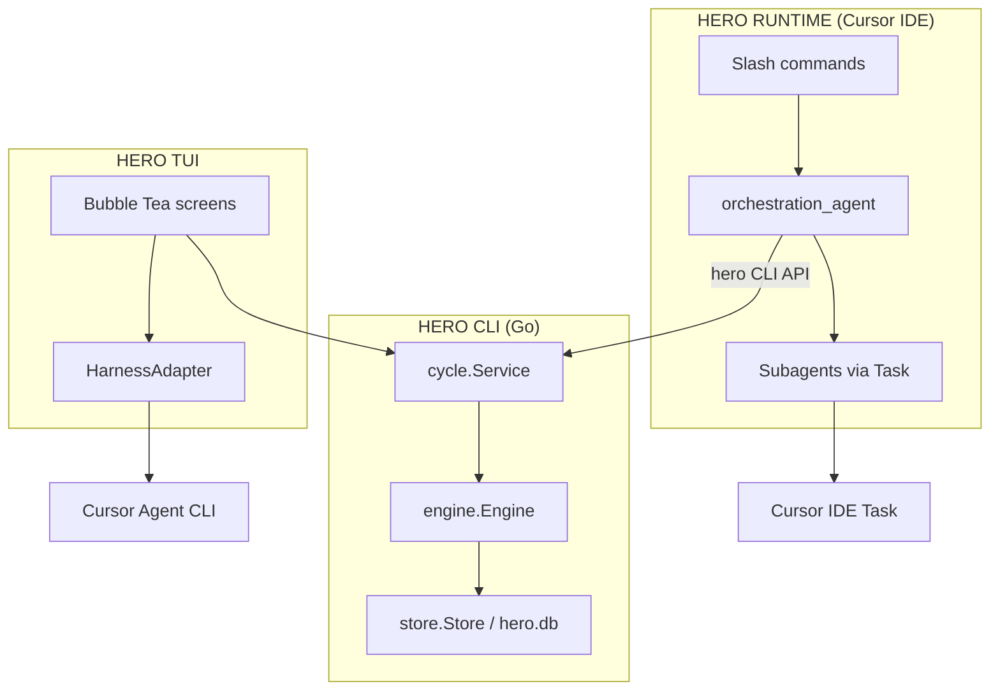

# Architecture Overview — AI Workflow Hero

> High-level architecture of the Hero **framework** (Go CLI + embedded Runtime assets).  
> For decisions and rationale, see [ADR.md](ADR.md). For cycle-specific deltas, see ADR-C01 / C02 / C03.  
> **Status:** reflects codebase at Hero **2.9.0** (TUI settings screen, checklist window, harness config adjustments, auto-hide Config after archive). Cursor + OpenCode + Codex TUI harnesses; Execute/Prepare/orphan/health wired.

Hero V1 is **two coupled systems**: a **deterministic Go CLI** and a **reasoning Runtime** in the IDE harness (Cursor only in V1). The CLI never performs LLM reasoning; orchestration lives in Runtime assets and, optionally, in the Hero TUI via the harness Agent CLI.

---

## Technology stack

| Concern | Choice |
|---|---|
| Language | Go 1.25+ (`modernc.org/sqlite`, no CGO) |
| Module | `github.com/ricrsantos/ai_workflow_hero` |
| CLI | Cobra + `internal/common/clierr` |
| TUI | Bubble Tea + lipgloss + huh (install prompts) |
| Assets | `assets.FS` (`embed.FS`) |
| Operational store | SQLite at `.workflow-hero/hero.db` (schema v8) |
| SDD | OpenSpec (external CLI; coupled at archive) |
| V1 harness | Cursor Agent CLI (`cursor-agent` / `cursor agent`) |
| Platforms | Linux/macOS `amd64` / `arm64` |
| License | BSD-2-Clause |

---

## Repository topology

```
ai_workflow_hero/
├── cmd/hero/              # Cobra root; default RunE → TUI
├── assets/                # embed.FS: cursor/, templates/, models/, config/, docs/
├── internal/
│   ├── install · upgrade · uninstall · doctor · status · variables · update_models
│   ├── cycle · engine · store · tui · harness · todos · workflowconfig · ideadocs
│   ├── adapters/cursor/   # Cursor Agent CLI adapter (NDJSON stream-json)
│   ├── adapters/opencode/ # OpenCode serve HTTP + SSE /event
│   ├── adapters/codex/    # Codex app-server stdio JSON-RPC + PrepareHeroStart (C6 §4–§7; Hero 2.5.0)
│   ├── common/            # template, clierr, output, envhygiene, userpath
│   └── integration/       # install/upgrade/doctor integration tests
├── scripts/               # release.sh, build_dev.sh (+ contract tests)
├── docs/                  # PRD, UI, ADR, deployment, testing
├── context/               # current-state.md, context-log.md (dogfood state)
├── openspec/              # living specs + archived changes
└── .workflow-hero/        # this repo's own Hero install (config, cycles, templates)
```

Runtime markdown for consumers is **not** edited under `.cursor/` in the framework repo long-term — canonical copies live in `assets/cursor/` and are materialized by `hero install`.

---

## Level 0 — Binary and project boundary

```
                    ┌─────────────────────────────────────────────────────────┐
                    │              HERO BINARY (`hero`)                       │
                    │         Go + Cobra + embed.FS (`assets.FS`)             │
                    └───────────────────────────┬─────────────────────────────┘
                                                │
              ┌─────────────────────────────────┴─────────────────────────────────┐
              │                                                                   │
       HERO CLI (deterministic)                              HERO RUNTIME (reasoning)
       never calls LLM                                        IDE / harness only
              │                                                                   │
              │                              materialized by `hero install`         │
              │                              into `.cursor/` + `.workflow-hero/`    │
              │                                                                   │
              └───────────────────────────┬───────────────────────────────────────┘
                                          │
                              User project (git required, ADR-004)
```

- **Single binary** ships CLI logic and embedded assets (`assets.version` == `cli.version`, ADR-001).
- **Install** copies commands, agents, skills, templates, and docs into the consumer project.
- **Git** is mandatory for checkpoints and rollback semantics.

---

## Level 1 — CLI vs Runtime (ADR-003)

```
  HERO CLI                              HERO RUNTIME (Cursor V1)
  ─────────                             ─────────────────────────
  install · upgrade · uninstall         `.cursor/commands/`   (slash command markdown)
  doctor · status · variables           `.cursor/agents/`     (specialized agents)
  update-models                         `.cursor/skills/`     (workflow-hero, grilling)
  metrics · events · approve · …        orchestration agent   (main session)
  cycle · run · tui                     TUI Execute → named stage agents; Task → nested fan-out
        │                                      │
        │  persistence via `hero …`            │  reasoning + agent dispatch
        └──────────────────┬───────────────────┘
                             │
                    SQLite + filesystem
```

| Plane | Responsibility | Must not |
|---|---|---|
| **CLI** | Install, upgrade, state transitions, metrics, TUI shell | Call LLMs or scrape the web for reasoning |
| **Runtime** | Research, planning, implementation, QA, judge, sync | Own canonical cycle state without `hero` CLI |

Administrative operations may exist in both planes (e.g. status). Work that requires agent reasoning exists **only** in Runtime (and TUI harness execution), not as hidden logic inside the binary.

---

## Level 2 — CLI internal structure (ADR-002)

Repository layout: **feature-based vertical slices** under `internal/<feature>/`, plus `internal/adapters/cursor/` and `internal/common/`.

```
                         `cmd/hero/main.go` (Cobra root; no args → TUI)
                                    │
        ┌───────────────────────────┼───────────────────────────┐
        │                           │                           │
   Lifecycle / Admin            Operational API              Bubble Tea TUI
   (vertical slices)            (`internal/cycle`)          (`internal/tui`)
        │                           │                           │
   install ──┐                 cycle.Service ◄──────────────────┘
   upgrade   │                      │
   uninstall │              ┌───────┴───────┐
   doctor     │              │               │
   status      │         store.Store    engine.Engine
   variables   │    (`internal/store`)  (`internal/engine`)
   update-models│         SQLite            │
        │      │    `.workflow-hero/      deterministic
        │      │         hero.db`         state machine
        │      │                          (stages, locks,
        │      │                           approvals, metrics)
        └──────┴──────────────────────────────────────────────┐
                                                              │
                    internal/harness.HarnessAdapter           │
                    + stream normalization (StreamDelta)      │
                              │                               │
              ┌───────────────┴───────────────┐               │
              │                               │               │
    internal/adapters/cursor.Adapter          │               │
    runner · parse · commands · models        │               │
              │                               │               │
    internal/adapters/opencode.Adapter        │               │
    serve · server lifecycle · events · HTTP  │               │
              │                               │               │
    internal/adapters/codex.Adapter (C6)      │               │
    app-server · stdio JSON-RPC · events      │               │
                              │                               │
                    internal/common/                          │
                    template · clierr · output · envhygiene   │
                    userpath (nvm/fnm/volta bin discovery)    │
```

### CLI command surface

| Group | Commands | Notes |
|---|---|---|
| **Default** | `hero` (no args) | Opens TUI; requires prior `hero install` |
| **Lifecycle** | `install`, `upgrade`, `uninstall` | Materialize/sync embedded assets |
| **Diagnostics** | `doctor`, `status`, `variables`, `version` | Table default; `--json` where supported |
| **Models** | `update-models` | Fetches upstream pricing YAML from GitHub |
| **TUI** | `tui` | Explicit TUI entry (same as default) |
| **Cycle API** | `metrics`, `events`, `approve`, `reject`, `cancel`, `finish`, `continue` | CLI-as-API (ADR-014) |
| **Stage** | `stage start`, `stage close` | Direct stage transitions |
| **Cycle** | `cycle new`, `cycle sync-config`, `cycle archive`, `cycle resume`, `cycle openspec-change` | Lifecycle + OpenSpec coupling |
| **Harness** | `run` | One-shot harness Execute (tests / automation) |

Global flags: `--verbose`, `--debug` (registered; not fully wired to stack traces yet).

### `internal/cycle` responsibilities

| File / area | Role |
|---|---|
| `service.go` | Façade for CLI, TUI, and `hero run`; archive/OpenSpec coupling (`Archive*`) |
| `command.go` | Cobra wiring for operational API |
| `ensure.go` | `EnsureOperationalStore`: open/migrate DB; one-time legacy `workflow.md` import |
| `openspec.go` | OpenSpec archive runner + change resolution (PATH + nvm/fnm/volta/user bins) |
| `approvals.go` | Approve/reject/continue payloads |
| `artifacts.go` | Artifact metadata registration |
| `cycles_list.go` | List/resume archived cycles |
| `project_json.go` | `project.json` helpers |

### Operational API

`internal/cycle` exposes the **CLI-as-API** (ADR-014): deterministic verbs for cycle lifecycle, stage transitions, metrics, and events. The Runtime orchestrator and TUI call the same API; SQLite is the **source of truth** for operational state (ADR-013).

### Workflow engine

`internal/engine` implements the **AI Loop** state machine (ADR-012): enabled stages, iterations, human approval gates, escalation, and transitions. It does **not** orchestrate LLMs — it only validates and persists state.

---

## Level 3 — Hero TUI (ADR-015, ADR-017, ADR-026)

Default entry: `hero` / `hero tui` (requires `FindProjectRoot` / `.workflow-hero/`). Free-chat entry: `hero chat` (Chat-only; no project install/git; config under `~/.workflow-hero/`; Execute workspace = cwd). Requires a TTY; uses Bubble Tea + lipgloss.

```
  `hero` (default) / `hero tui`
              │
       Bubble Tea App (`internal/tui`)
              │
    ┌─────────┼─────────┬──────────┬──────────┬──────────────┐
    │         │         │          │          │              │
  Chat    Status   Artifacts   Costs     Events    Config (active cycle)
    │         │         │          │          │              │
    └─────────┴─────────┴──────────┴──────────┘              │
              │                                              │
         cycle.Service (read / mutate views)           HarnessAdapter
              │                                    Execute · Cancel · Stream
    Command palette + imported harness prompts                 │
    (markdown expansion)                              Cursor Adapter
              │                                              │
         hero.db mutations                              cursor-agent CLI
```

**Screens** (`alt+1` … `alt+5`): Chat, Status, Artifacts, Costs, Events. With an active project cycle, Config is appended as `alt+6`; when it is hidden, `alt+6` is a no-op. Ctrl aliases are not part of the TUI keymap. Tab switches shell focus between the active screen and navbar; while the navbar owns focus, Up/Down move its independent luminous cursor and Enter activates the selected screen, while `>` continues to identify the active screen. The navbar footer shows only `alt+1-5` or `alt+1-6` accordingly. Approvals are handled in Chat via `/hero-approve` / `/hero-reject` (no separate Approvals screen). `hero chat` shows Chat only. Config is unavailable without an active cycle.

**TUI modules** (selected):

| Module | Role |
|---|---|
| `app.go` / `screens.go` | Bubble Tea model, screen routing, keybindings |
| `conversation.go` | Chat transcript, multiplexed harness Executes, Execute lifecycle |
| `research_session.go` | Dedicated `discover_agent` session during Research; injects active `docs/idea` paths via `ideadocs` |
| `stage_handoff.go` | TUI-direct Execute of named stage agents after ORCH `hero stage start` then STOP |
| `herocmd.go` | `/hero-*` slash dispatch and orchestrator prompt assembly |
| `palette.go` / `slash_overlay.go` | Command palette and Chat `/` autocomplete |
| `harness_boot.go` / `model_gate.go` | Harness availability, model picker at boot |
| `agentlabels.go` / `chat_format.go` | Live agents box and `[LABEL - model]` transcript |
| `contextbar.go` | Session-accumulated per-turn token usage bar from `result.usage` vs `models/*.yml` |
| `config_screen.go` | Active-cycle YAML-backed form, progressive disclosure, save states, and failed-stage retry |
| `timers.go` | Shared one-second Session/AI wk/AI rp counters and cycle-duration persistence |
| `internal/workflowconfig` document layer | Latest-file YAML node merge, managed projection/diff, validation, and atomic write |
| `output_view.go` | Shared scrollable output for Status/Costs/Events |

**Design principles:**

- **Go owns the state machine**; TUI reads and mutates via `cycle.Service`.
- **Harness conversations** use `HarnessAdapter.Execute` with streaming (`stream-json`), not IDE chat injection (ADR-026).
- **Dual OpenCode-style panes** on Chat: composer + response area; session IDs for harness runs are held in TUI memory and/or SQLite `stages.harness_session_id` (schema v3).
- **Orchestrator vs Research**: TUI Execute for control slashes uses `agents.orchestration_agent` from `workflow-config.yml`; Research uses a separate `discover_agent` session (`research_session.go`); Cursor IDE chat keeps grilling in the orchestrator session.
- **TUI-direct stage Execute (C8)**: after ORCH starts a stage and STOPs, the TUI Executes named stage agents on their YAML harness+model pair (`stage_handoff.go`). Nested Task fan-out stays inside the parent harness; generic Tasks chip `TASK`. Implementation may run BACK/FRNT/GEN concurrently. Cursor IDE Runtime still uses Task for every subagent (ADR-005 / ADR-054).
- **Boot** validates harness availability (`IsAvailable`); may prompt for harness selection when `cli.tools` is empty (ADR-027).
- **Default harness model** is stored in `hero.json` → `harnesses.<tool>` (ADR-030); per-cycle agent models live in `workflow-config.yml`. Freechat and `/hero-new` use the harness default; orchestrator slashes use YAML `orchestration_agent` (then `fallback_model`, then `/hero-model`).
- **Cycle Config (C7)**: the TUI edits only managed YAML nodes; the latest file supplies unmanaged comments/unknown keys during Save. Successful Save calls cycle sync; completed stages remain protected, and a changed failed stage can be explicitly requeued through `cycle.Service.RetryFailedStage`.
- **Shared TUI timers**: one second tick drives the blue bottom-navbar `Session`, `AI wk`, and `AI rp` values. `Session` starts at zero on TUI boot, persists active cycle seconds in `cycles.session_duration_seconds` for explicit `/hero-start`/`/hero-resume` recovery, stops at a terminal cycle state, and resets on `/hero-new`, archive, or an ordinary first chat prompt before a cycle session is restored. `AI wk` measures a live Execute; process-local `AI rp` starts on the first harness response rendered in Chat and restarts on every later response, exposing the elapsed response gap.

---

## Level 4 — Runtime orchestration (Cursor)

```
  Cursor IDE Chat
        │
  Slash commands (hero-*.md assets)
        │
  orchestration_agent  ← continuous cycle session (IDE Task; TUI start-then-STOP)
        │
        ├─► TUI-direct Execute (named stage agents, YAML pair; ADR-054)
        │         nested Task fan-out stays in the parent harness
        │
        ├─► Task (Cursor IDE Runtime only — clean session per subagent, ADR-005)
        │         │
        │    discover · planning · context · backend · frontend
        │    generic · qa · judge · browser_ui · end2end_qa
        │
        ├─► `hero …` CLI verbs (CLI-as-API)
        │
        ├─► OpenSpec (SDD in Planning; archive coupling, ADR-007 / ADR-023)
        │
        └─► git checkpoints (rollback on cancel, ADR-004)
```

### Stage pipeline

```
Configuration → Research → Planning → Implementation → QA → Judge
                                                      → Browser UI Validation (optional, default off)
                                                      → QA End-to-End (optional)
```

Stages are configured per cycle in `workflow-config.yml`; the engine enforces which stages exist and their approval rules. Stage statuses: `Waiting`, `Running`, `PendingApproval`, `Completed`, `Escalated`, `Failed`, `Skipped`.

### Embedded Runtime inventory (`assets/`)

| Asset type | Count | Install target |
|---|---|---|
| Slash commands (`hero-*.md`) | 16 | `.cursor/commands/` |
| Agents (`*_agent.md`) | 11 | `.cursor/agents/` |
| Skills | 2 (`workflow-hero`, `grilling`) | `.cursor/skills/` |
| Model pricing YAML | 7 providers | `.workflow-hero/models/` |
| Templates | AGENTS.md, workflow-config.yml, context files, etc. | `.workflow-hero/templates/` + project root |
| Config | `documents.json` (+ generated `hero.json`, `project.json`) | `.workflow-hero/config/` |
| End-user guide | `workflow-help.md` | `.workflow-hero/docs/` |

Agents: `orchestration_agent`, `discover_agent`, `planning_agent`, `context_agent`, `backend_agent`, `frontend_agent`, `generic_agent`, `qa_agent`, `judge_agent`, `browser_ui_agent`, `end2end_qa_agent`.

---

## Persistence and on-disk layout

```
  Installed project
        │
  ┌─────┴──────────────────────────────────────────────────────────────┐
  │                                                                    │
  .cursor/                          .workflow-hero/                    │
  ├── commands/                     ├── hero.db          ← SQLite SoT   │
  ├── agents/                       ├── config/          ← hero.json,   │
  └── skills/                       │                      project.json │
                                    ├── templates/                         │
                                    ├── models/          ← pricing YAML   │
                                    ├── docs/            ← workflow-help  │
                                    └── cycles/current/  ← cycle config   │
                                        and artifacts                      │
  context/ · openspec/ · docs/ · AGENTS.md  (project knowledge, not SoT)   │
```

**SQLite** (`internal/store`) holds cycles, stages, events, metrics, artifact metadata, harness session references per stage where persisted, and the accumulated active cycle Session timer seconds.

**Schema v8** (`internal/store/migrate.go`):

| Table | Purpose |
|---|---|
| `cycles` | Cycle row; v2 adds `openspec_change`; v8 adds `session_duration_seconds` |
| `stages` | Per-cycle stage state; v3 adds `harness_session_id` |
| `events` | Append-only operational log |
| `metrics` | Per-stage/agent token/cost estimates |
| `artifacts` | Linked file metadata |
| `conversation` | Approval/question records (not TUI chat SoT) |
| `schema_migrations` | Applied migration versions |

On first open with an empty DB, `cycle.EnsureOperationalStore` may **import once** from legacy `workflow.md` / `metrics.md` (`store/import_legacy.go`).

Legacy cycle markdown (`workflow.md`, `metrics.md`) is **not** operational source of truth after import.

**Install materialization** (`internal/install`): git check (optional `git init`), huh prompts for name/summary, copy assets with checksum tracking (`checksums.json`), render templates via `{{path.key}}`, write `hero.json` / `project.json`, env-hygiene patterns, harness-marker warnings (`harness.DetectMarkers`).

---

## Harness abstraction (ADR-016, ADR-025, ADR-035)

```
                    HarnessAdapter (interface)
                              │
              ┌───────────────┴───────────────┐
              │                               │
        Cursor Adapter                  OpenCode Adapter
        (Agent CLI NDJSON)            (opencode serve SSE)
              │                               │
              └───────────────┬───────────────┘
                              │
                    StreamDelta normalization
                    (text · thinking · tool · warning ·
                     permission · activity · session)
                              │
                    TUI Chat / hero run
```

| Transport | Harness | Parser |
|---|---|---|
| Process stdout NDJSON (`stream-json`) | Cursor | `adapters/cursor/parse.go` |
| HTTP SSE `GET /event` | OpenCode | `adapters/opencode/events.go` |

**Normalized `StreamDelta` kinds** (shared contract in `internal/harness/stream.go`):

| Kind | Use |
|---|---|
| `text` | Assistant output (incremental) |
| `thinking` | Reasoning / chain-of-thought |
| `tool` | Tool activity (`started` / `completed` phases) |
| `warning` | Unrecognized or malformed harness events |
| `permission` | Harness approval prompt (blocks via `OnPermissionRequest`) |
| `activity` | Observability (file edits, todos, LSP, TUI events) |
| `session` | Idle / running / failed lifecycle |

**Project-scoped permission profiles:** `hero.json` stores `harnesses.<id>.permission_profile`; blank legacy values normalize to conservative `ask`. `/hero-harness` manages the enabled set and then profiles for every enabled adapter. `auto-project` never grants unrestricted yolo: OpenCode receives process-local inline rules (workspace tools allowed; shell, network, MCP, and external directories ask), Codex retains native `on-request` and auto-replies only to workspace-confined file changes, and Cursor uses sandboxed Smart Auto without MCP auto-approval.

**Rules:**

- Adapters SHALL NOT silently drop parseable events; unknown types emit `StreamKindWarning`.
- OpenCode `permission.asked` blocks until TUI responds; reply via `POST /permission/{requestID}/reply`.
- Cursor without terminal `result` + non-zero exit code fails with stderr detail.
- Cursor `stream-json` success with no substantive output fails with an explicit empty-response error.

**Harness watchdog (v2.3+, TUI only):**

```
  TUI Execute (streaming)
        │
        ├─ stream deltas → Watchdog.RecordDelta
        │                  only text/thinking/tool/question/permission reset stall
        │                  (file.watcher / lsp / session.status running do not)
        │
        └─ periodic HealthChecker.CheckHealth (30s, single-flight, read-only)
                 │
                 ▼
           Evaluate(process + server + session + last activity)
                 │
     ┌───────────┼──────────────────┬─────────────────┐
     ▼           ▼                  ▼                 ▼
 healthy    suspected_hang     degraded          failed
              │                  │                 │
              │ warn only        │ warn only       │ auto-cancel Execute
              │ (busy tools OK)  │                 │ (process/session dead)
              └──────────────────┴─────────────────┘
```

- Stall timeouts: Cursor 5m, OpenCode/Codex **3m** (`internal/harness/health.go`).
- `HealthFailed` (process dead or OpenCode session 404) ends the stream (`cancelStreamCmd`); `HealthSuspected` stays warn-only while the session is still `busy`.
- OpenCode health: `GET /global/health` + read-only `GET /session/{id}` (no `ensureServe`); Cursor: `HasInFlight()` + session status.
- OpenCode Execute: `ResumeSession` before `prompt_async`; `session.bound` persists the id before SSE; idle/gone probes close a silent `GET /event`; `Cancel("")` cancels every in-flight `runCtx`. Serve is started with `exec.Command` (not `CommandContext(runCtx)`) so recovery survives Cancel.
- Empty successful Execute → TUI warning (`convRoleWarning`); not applied to Cursor IDE chat Runtime.

- **Execute**: multi-turn agent runs from TUI Chat (and `hero run` paths).
- **Dispatch**: thin wrapper → fresh Execute session (palette paths; no leaked `--resume`).
- **Parse** (`adapters/cursor/parse.go`): `json` and `stream-json` (+ `--stream-partial-output`); Task attribution for nested subagents; warnings for unknown NDJSON types.
- **Events** (`adapters/opencode/events.go`): full SSE event map; tool/thinking/permission/session handling.
- **Runner** (`runner.go`): `StreamingCommandRunner` pipes stdout; prepends user bin dirs to PATH.
- **Runtime** uses IDE chat and Task directly; TUI uses Agent CLI or OpenCode serve — same project cwd, different UX surfaces.

---

## Conversation model (three layers)

There is **no** standalone `internal/conversation` package. Conversation appears in three places:

| Layer | Where | Lifetime |
|---|---|---|
| **TUI Chat UI** | `internal/tui/conversation.go` + `stage_handoff.go` — transcript in memory; one or more tagged Executes multiplexed on one channel | Process lifetime; optional resume via harness session id |
| **IDE Runtime** | Cursor chat + Task sessions | IDE session / Task isolation (ADR-005) |
| **SQLite `conversation` table** | `internal/store` | Persisted messages; **not** wired as the TUI chat transcript SoT in V1 |

**Free chat** (no active dispatchable stage): TUI sets `conversationStage == ""`; harness session may exist only in TUI memory until the user starts a cycle-bound stage.

---

## Dual entry — execution paths (architectural)

Both **Cursor chat** and **Hero TUI** read and write the same SQLite store when the CLI API is invoked.

```
                    TUI                              IDE Runtime
                     │                                │
         ┌───────────┼───────────┬──────────┐         │
         │           │           │          │         │
    CLI direct   Go format   Dispatch   Execute    Orchestrator
    (state API)  (views)     (harness)  (Chat)     (agents + Task)
         │           │           │          │         │
         └───────────┴───────────┴──────────┘         │
                     │                                │
                     └────────────┬───────────────────┘
                                  ▼
                         hero.db (SQLite)
```

- **CLI direct**: deterministic `cycle.Service` mutations and queries.
- **Go format**: TUI renders lists/tables from store and parsers (no LLM).
- **Harness Execute / Dispatch**: TUI expands embedded or installed markdown into Agent CLI prompts.
- **Orchestrator**: Runtime interprets command assets, calls `hero …`, and fans out Task subagents.

Parity between TUI and chat is **intentional but not identical** — see [idea note on command alignment](../idea/commands_alignments/comparation.md) for a command-level matrix (non-normative).

---

## External dependencies

| Dependency | Role |
|---|---|
| **Git** | Mandatory; checkpoints and rollback |
| **Cursor Agent CLI** | TUI harness execution; doctor validation |
| **Cursor IDE** | Runtime chat, Task tool, subagents |
| **OpenSpec** | SDD workflow; archive coupling with Hero cycles |
| **GitHub (raw)** | `hero update-models` upstream pricing YAML |

---

## V1 boundaries (not implemented)

| Concept | V1 state |
|---|---|
| Generic **Conversation Layer** service | Chat in TUI + IDE only |
| **Multi-harness** adapters | Cursor + OpenCode with normalized stream events; further harnesses post-2.x |
| **Daemon / RPC** | CLI-as-API only (ADR-014) |
| **Distributed event bus** | Events in SQLite |
| **LLM inside CLI** | Forbidden (ADR-003) |

---

## End-to-end cycle flow



---

## Testing layout (ADR-009)

| Location | Scope |
|---|---|
| `internal/<feature>/*_test.go` | Colocated unit/golden tests per vertical slice |
| `internal/integration/` | Real `t.TempDir()` install/upgrade/uninstall/doctor flows |
| `scripts/release_test.go` | Release artifact naming, platforms, checksum contract |
| `internal/common/runtime_assets_test.go` | Embedded asset inventory and Runtime semantics |

Command: `go test ./...` (see [TESTING.md](../testing/TESTING.md)).

---

## Go package map

| Package | Responsibility |
|---|---|
| `cmd/hero` | Cobra entrypoint; version via `-ldflags` |
| `assets` | `embed.FS` of Runtime assets |
| `internal/install` · `upgrade` · `uninstall` | Project materialization and maintenance |
| `internal/doctor` · `status` · `variables` | Diagnostics and introspection (`doctor/cursor_cli.go` checks Agent CLI) |
| `internal/update_models` | Upstream model pricing sync |
| `internal/cycle` | CLI-as-API, archive, OpenSpec coupling, legacy import |
| `internal/engine` | Deterministic AI Loop state machine |
| `internal/store` | SQLite operational store + migrations |
| `internal/harness` | `HarnessAdapter` interface, `StreamDelta` normalization, marker detection |
| `internal/adapters/cursor` | Cursor Agent CLI adapter, paths, command import, NDJSON parse |
| `internal/adapters/opencode` | OpenCode serve adapter: HTTP+SSE, ResumeSession, idle/gone SSE probe, serve lifecycle (PID registry, `exec.Command` not Execute-scoped), orphan reap, C5 properties |
| `internal/adapters/codex` | Codex app-server adapter (stdio JSON-RPC, thread/turn, registry, auth, C5 properties, stream map, CheckHealth, ResetAppServer, PrepareHeroStart) |
| `internal/harnessmgr` | Adapter registry (cursor + opencode + codex), fallback chain, boot ListModels skip for lazy children |
| `internal/tui` | Bubble Tea terminal UI |
| `internal/todos` | `## Pending` section parser in `current-state.md` |
| `internal/workflowconfig` | `workflow-config.yml` load/normalize; C7 managed node document, validation, merge, and atomic write |
| `internal/integration` | Cross-feature integration tests (test-only) |
| `internal/common/template` | `{{path.key}}` substitution (ADR-006) |
| `internal/common/clierr` | Formatted CLI errors with suggestions |
| `internal/common/output` | Table/JSON output helpers |
| `internal/common/envhygiene` | `.env.example`, gitignore secrets patterns |
| `internal/common/userpath` | nvm/fnm/volta/`~/.local/bin` discovery for subprocess PATH |

---

## Summary

Hero **installs** Runtime assets into the consumer project, **persists** cycle state in SQLite through a deterministic engine, and exposes **two entry UIs**: Cursor chat (full orchestration) and Hero TUI (monitoring, approvals, and harness-driven conversation). Reasoning always happens in the harness; the Go binary coordinates, validates, and records — it does not replace the IDE orchestrator for full workflow execution unless explicitly driven through harness Execute from the TUI.
