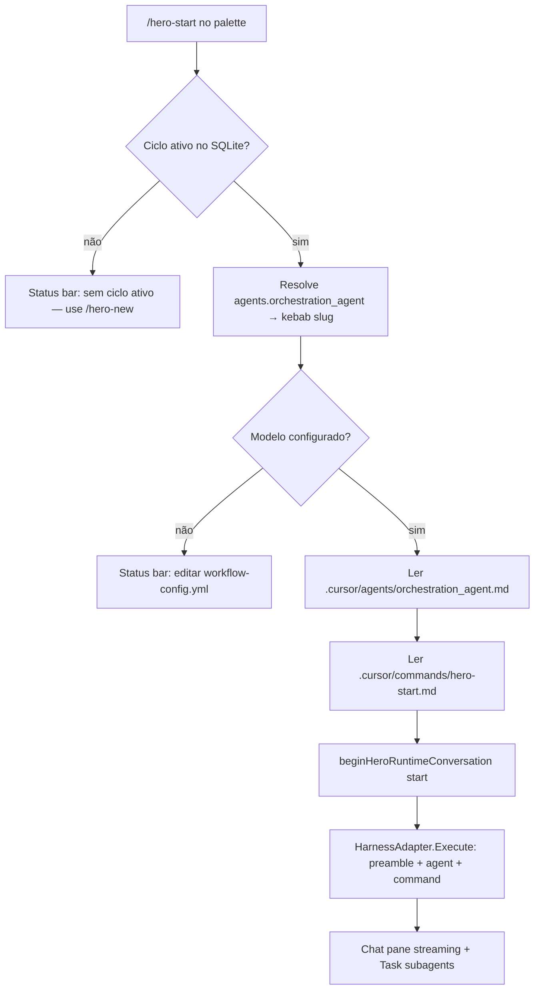

# Plano: alinhamento `/hero-start` (TUI × Chat)

> **Status:** implementado (2026-08-12).

Non-normative idea note. Para verdade de produto, ver PRD/UI/ADR (C2 slash parity, C3 harness autonomy).

---

## Contexto e gap atual

| Aspecto | TUI hoje | Chat (Cursor) |
|---|---|---|
| Mecanismo | `beginAction` → `dispatchCmd` → `svc.RunWith` → prompt genérico em [`runPrompt`](../../../internal/cycle/service.go) | Expansão de [`hero-start.md`](../../../assets/cursor/commands/hero-start.md) + sessão `orchestration_agent` |
| Markdown | **Não lê** `hero-start.md` | Lê e executa o markdown completo |
| Agente | Não usa `orchestration_agent.md` | IDE carrega [`.cursor/agents/orchestration_agent.md`](../../../.cursor/agents/orchestration_agent.md) |
| UI | Action panel (sem stream) | Chat IDE com streaming |
| Modelo | `/hero-model` → `hero.json` (via `RunWith`) | Modelo da sessão escolhido pelo usuário no chat |
| Ciclo SQLite | Exige ciclo ativo (não cria) | `hero cycle new` ocorre em `/hero-new` antes do start |

Referência de alinhamento já feito: [`comparation.md`](comparation.md) — `/hero-new` usa `beginHeroRuntimeConversation("new")` em [`app.go`](../../../internal/tui/app.go).

---

## Objetivo de paridade

Na TUI, `/hero-start` deve:

1. **Exigir ciclo ativo no SQLite.** Se não há ciclo ativo, **não executar** — mostrar erro na status bar informando que não existe ciclo ativo e que o usuário pode iniciar com `/hero-new` (sem chamar `svc.NewCycle` neste comando).
2. Abrir a tela **Chat** e executar `HarnessAdapter.Execute` com stream (Runtime Execute).
3. Montar o prompt com três camadas (ordem sugerida):
   - **Preamble TUI** ([`chat_format.go`](../../../internal/tui/chat_format.go) — `tuiHeroStartPreamble()`).
   - **Corpo do agente** [`orchestration_agent.md`](../../../.cursor/agents/orchestration_agent.md) (instalado em `.cursor/agents/` a partir de [`assets/cursor/agents/orchestration_agent.md`](../../../assets/cursor/agents/orchestration_agent.md)) — o agente orquestrador com Model Resolution, Metrics Procedure, Stage Close Sequence, etc.
   - **Corpo do comando** [`hero-start.md`](../../../assets/cursor/commands/hero-start.md) (via `ReadCommandPrompt`, como `/hero-new`).
4. Orquestrar o workflow completo (bootstrap do disco, validação de config, etapas via Task subagents, persistência `hero approve/finish` + métricas) — igual ao chat.
5. Usar o modelo do **orquestrador** de `workflow-config.yml` → `agents.orchestration_agent`, **não** `/hero-model`.
6. Definir `ExecuteRequest.AgentName = "orchestration_agent"` para rastreamento de sessão/log.

Diferença intencional (TUI-only): modelo do orquestrador vem de `agents.orchestration_agent` no YAML; no chat o usuário escolhe o modelo na sessão do IDE (o bloco YAML é ignorado).

**Pré-requisito de ciclo:** na TUI, `/hero-new` ainda não cria o ciclo no SQLite (v1.0.1). O ciclo ativo precisa existir antes de `/hero-start` (ex.: `hero cycle new` após editar o config, ou alinhamento futuro de `/hero-new`). Este plano **não** compensa isso em `/hero-start` — apenas bloqueia com erro + CTA `/hero-new`.

---

## Fluxo alvo (TUI)



---

## 1. `workflow-config.yml` — bloco `orchestration_agent`

**Arquivos:**

- [`assets/templates/workflow-config.yml`](../../../assets/templates/workflow-config.yml)
- [`.workflow-hero/templates/workflow-config.yml`](../../../.workflow-hero/templates/workflow-config.yml)

**Adicionar** em `agents:` (topo da seção), seguindo o padrão existente (`model`, `reasoning_effort`, `enable_fast_model`, `thinking`, `subagent`):

```yaml
  # TUI-only: model for /hero-start when run in the Hero TUI (HarnessAdapter.Execute).
  # In Cursor IDE chat, /hero-start uses the session model you pick in the chat — this block is not applied.
  orchestration_agent:
    model: gpt-5.3-codex
    reasoning_effort: medium
    enable_fast_model: false
    thinking: na
    subagent:
      same_of_agent: false
      model: composer-2.5
      reasoning_effort: na
      enable_fast_model: false
      thinking: na
```

**Import em `/hero-new`:** o bloco entra automaticamente na coluna “importar `agents`” de [`hero-new.md`](../../../assets/cursor/commands/hero-new.md).

**Testes de assets:** atualizar [`internal/common/assets_test.go`](../../../internal/common/assets_test.go) — incluir `orchestration_agent` na lista de agentes com `subagent` em `TestAssets_WorkflowConfigNestedSubagent`.

---

## 2. Resolução de modelo em Go (kebab slug)

Hoje só existe resolução parcial em [`internal/install/harness_model.go`](../../../internal/install/harness_model.go) (`model` + `enable_fast_model`). O orquestrador precisa da regra completa de [`orchestration_agent.md`](../../../assets/cursor/agents/orchestration_agent.md) § Model Resolution (steps 2–6: `-fast`, `-effort`, `-thinking`).

**Criar** pacote pequeno, por exemplo `internal/workflowconfig/`:

- `AgentModelConfig` (campos YAML do bloco agente + `fallback_model`)
- `LoadCurrent(projectDir)` — lê `.workflow-hero/cycles/current/workflow-config.yml` (fallback: templates)
- `ResolveModelSlug(cfg AgentModelConfig) string` — kebab slug
- `OrchestratorModelSlug(projectDir) (string, error)` — `agents.orchestration_agent`; fallback a `fallback_model` se vazio, com aviso

---

## 3. Leitura do agente `orchestration_agent`

**Arquivo fonte no projeto:** `.cursor/agents/orchestration_agent.md` (path constante [`AgentsDir`](../../../internal/adapters/cursor/paths.go)).

**Implementação sugerida:**

- Adicionar `ReadAgentPrompt(path string)` em [`internal/adapters/cursor/commands.go`](../../../internal/adapters/cursor/commands.go) (mesmo tratamento de frontmatter YAML que `ReadCommandPrompt` — corpo após o `---` closing do frontmatter).
- Em `beginHeroRuntimeConversation` para `start`, concatenar: `tuiHeroStartPreamble()` + corpo `orchestration_agent.md` + corpo `hero-start.md`.
- Teste: prompt contém marcadores de Model Resolution / Metrics Procedure do agente e do comando.

No chat Cursor, o IDE associa a sessão ao agente `orchestration_agent`; na TUI o equivalente é **incluir o markdown do agente no prompt** enviado ao `cursor-agent` CLI.

---

## 4. Mudanças na TUI

### 4.1 [`internal/tui/app.go`](../../../internal/tui/app.go) — handler `/hero-start`

Substituir:

```go
m, cmd, ok := m.ensureDefaultModel("/hero-start")
return m.beginAction("/hero-start", m.startCmd())
```

Por fluxo:

1. **Gate de ciclo:** `svc.Status()` — se `CycleNumber == 0` (ou erro “no active cycle”), status bar com erro: *“No active cycle. Run /hero-new to start.”* (ou mensagem equivalente em PT se a UI da TUI seguir idioma fixo EN). **Não** chamar `svc.NewCycle`.
2. `workflowconfig.OrchestratorModelSlug(projectDir)` — se vazio/erro, mensagem para editar `agents.orchestration_agent` em workflow-config.
3. `return m.beginHeroRuntimeConversation("start", orchestratorSlug)`.

**Remover** gate `/hero-model` para `/hero-start` (mantém para `/hero-new`, sync, back, chat free).

### 4.2 [`internal/tui/conversation.go`](../../../internal/tui/conversation.go)

- Estender `beginHeroRuntimeConversation(cmdName, modelSlug string)` — slug vazio → fallback `conversationModelSlug()` (compat `/hero-new`).
- Para `cmdName == "start"`: ler agente + comando; montar prompt composto; `AgentName = "orchestration_agent"`.
- `startConversationExecute` / label de modelo na UI: usar slug do runtime command (`runtimeExecuteModelSlug()`).
- Sessão `/hero-start`: fresh session (`harnessSessionID = ""`) como em `/hero-new`.

### 4.3 [`internal/tui/chat_format.go`](../../../internal/tui/chat_format.go) — preamble e formatação

Adicionar `tuiHeroStartPreamble()` em `tuiRuntimeCommandPrompt` quando `cmdName == "start"`:

Overrides TUI (espelho do que `/hero-new` já faz):

- Plain text only (→, ✓); sem markdown tables/links/bold.
- **Não** pedir novo chat vazio nem seleção de modelo no IDE.
- **Não** depender de histórico de `/hero-new`.
- **Não** rodar `hero cycle new` — o ciclo já deve existir no SQLite (criado antes deste comando).
- Orquestração completa permitida (Task subagents, `hero approve/finish`, métricas).
- Continuar no Hero TUI para `/hero-approve`, `/hero-reject`, etc. (sem handoff Cursor).

`formatChatAgentText`: opcional `normalizeTUIStartOutput` para remover linhas de handoff residual.

### 4.4 Limpeza

- `startCmd` / `dispatchCmd` para start — remover ou restringir se obsoleto.
- Atualizar [`internal/tui/status_bar.go`](../../../internal/tui/status_bar.go) se necessário.

---

## 5. Testes

| Teste | Foco |
|---|---|
| `TestHeroStartRuntimeConversation` em [`conversation_test.go`](../../../internal/tui/conversation_test.go) | Chat screen, streaming, prompt contém `hero-start.md` + trechos de `orchestration_agent.md`, modelo = slug resolvido, `AgentName` orchestration_agent, sessão nova |
| `TestHeroStartRequiresActiveCycle` | Sem ciclo ativo → erro na status bar, **sem** execute, mensagem menciona `/hero-new` |
| `TestHeroStartRequiresOrchestratorModel` | workflow-config sem model → erro na status bar, sem execute |
| `TestTUIRuntimeCommandPrompt_HeroStartOverrides` em [`chat_format_test.go`](../../../internal/tui/chat_format_test.go) | Preamble start ≠ new; sem handoff Cursor; sem `hero cycle new` |
| `internal/workflowconfig/*_test.go` | Resolução kebab: fast, effort, thinking, na |
| [`app_test.go`](../../../internal/tui/app_test.go) | Palette `/hero-start` não exige `/hero-model`; bloqueia sem ciclo |

Rodar `go test ./...` após implementação.

---

## 6. Documentação e artefatos (obrigatório ao final da implementação)

### 6.1 Este plano

Manter em **`docs/idea/commands_alignments/hero-start-alignment-plan.md`** (este arquivo).

### 6.2 Atualizar comparação

Em [`comparation.md`](comparation.md):

- Linha `/hero-start`: TUI = Runtime Execute + `orchestration_agent.md` + `hero-start.md` + modelo `agents.orchestration_agent` (TUI-only); exige ciclo ativo; Chat = orquestrador IDE.
- Alinhamento: **Alinhado** (paridade parcial).
- Schema § notas: `/hero-start` lê `hero-start.md` e usa `orchestration_agent.md`.
- Adicionar seção “`/hero-start` — o que mudou no alinhamento”.
- Atualizar “Próximo alvo” → sugerir `/hero-approve` ou próximo da tabela.

### 6.3 Context compression (regra AGENTS.md)

- [`context/current-state.md`](../../../context/current-state.md)
- [`context/context-log.md`](../../../context/context-log.md)

### 6.4 Opcional / leve

- [`assets/docs/workflow-help.md`](../../../assets/docs/workflow-help.md) — nota em `orchestration_agent`: IDE session model vs TUI workflow-config block.

**Sem** mudança normativa em PRD/ADR nesta entrega.

---

## Riscos e mitigações

| Risco | Mitigação |
|---|---|
| TUI `/hero-new` não cria ciclo SQLite | Erro em `/hero-start` aponta `/hero-new`; alinhamento futuro de `/hero-new` ou `hero cycle new` manual |
| Ciclos antigos sem `orchestration_agent` no YAML | Fallback a `fallback_model` + mensagem para adicionar o bloco |
| Slug inválido no Agent CLI | Erro na Chat pane; usuário ajusta workflow-config |
| Prompt muito longo (agent + command) | Aceito — paridade com contexto do orquestrador no IDE |
| `ensureDefaultModel` removido só para start | Manter gate para outros comandos que usam `hero.json` |

---

## Ordem de implementação sugerida

1. `workflow-config.yml` template + testes assets
2. `internal/workflowconfig` (load + resolve slug)
3. `ReadAgentPrompt` + montagem prompt (agent + command)
4. TUI: preamble start + `beginHeroRuntimeConversation` com slug e gate de ciclo
5. Testes TUI + workflowconfig
6. Docs: `comparation.md`, context files
